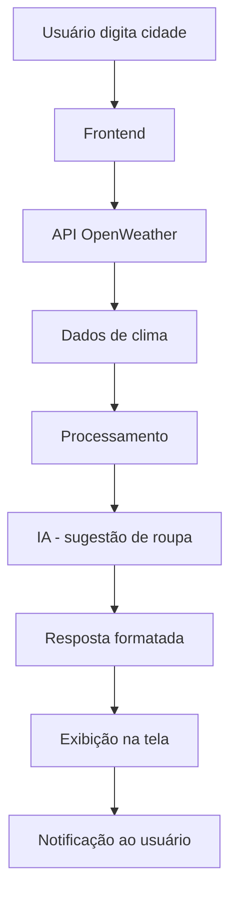

# **Projeto:** [LookDay]
### **Problema que resolve:**
O Look Day é um sistema simples que sugere a roupa ideal para o dia com base nas condições climáticas da cidade informada pelo usuário. O objetivo é facilitar decisões do dia a dia, utilizando dados externos e uma lógica inteligente de recomendação.

## Integrantes
| Nome | GitHub |
|------|--------|
| [Breno de Arruda Ferro] | [@euFerro] |
| [Lucas Facini] | [@LucasFacini01] |
| [Murilo Boschiero] | [@7JustAguy7] |

## Arquitetura

⸻

Objetivo

Ajudar o usuário a escolher o que vestir diariamente com base na temperatura e condição do tempo.

⸻

Funcionalidades
	•	Entrada de cidade pelo usuário
	•	Consulta de clima em tempo real
	•	Sugestão automática de roupa baseada no clima
	•	Notificação com recomendação do dia

⸻

Tecnologias Utilizadas
	•	Frontend: (definir depois – ex: HTML/CSS/JS ou React)
	•	Backend: (definir depois – ex: Node.js)
	•	API externa: OpenWeather API
	•	IA: Lógica simples de decisão baseada em temperatura e clima

⸻

Como Funciona
	1.	O usuário informa a cidade
	2.	O sistema consulta a API de clima
	3.	A IA interpreta os dados (temperatura e condição)
	4.	O sistema gera uma sugestão de roupa
	5.	O usuário recebe uma notificação com a recomendação

⸻

Exemplo de Regras
	•	Temperatura abaixo de 15°C → Casaco
	•	Entre 15°C e 25°C → Roupa leve
	•	Acima de 25°C → Roupa fresca
	•	Se estiver chovendo → Levar guarda-chuva

⸻

Integrações
	•	API de clima (OpenWeather)
	•	Sistema de notificação (alerta na aplicação ou navegador)

⸻

Status do Projeto

Em desenvolvimento – Setup inicial do projeto.
